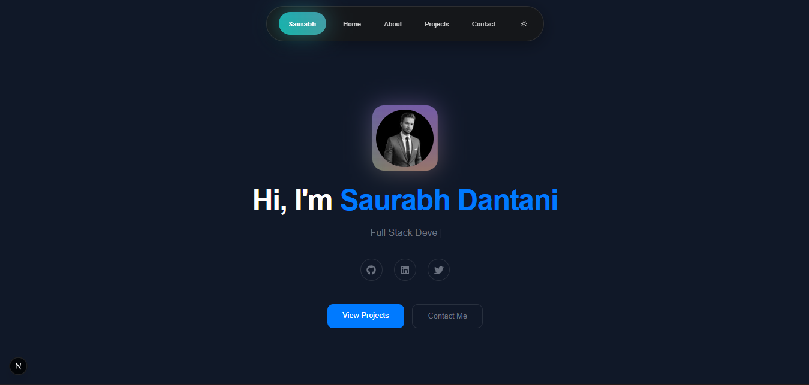

# Folio - Personal Portfolio



A modern, responsive personal portfolio website built with Next.js 15, Tailwind CSS, and Framer Motion. This project showcases my skills, projects, and professional background with a sleek and dynamic user experience.

## ✨ Features

- **Modern & Responsive Design**: Built with Tailwind CSS v4 for a clean, mobile-first aesthetic.
- **Dynamic Animations**: Smooth transitions and effects powered by Framer Motion.
- **Typing Effects**: Interactive text elements using `react-simple-typewriter`.
- **Component-Based Architecture**: Modular and reusable React components.
- **Optimized Performance**: Leveraging Next.js 15 capabilities like App Router and Turbopack.
- **TypeScript Support**: Fully typed codebase for reliability and maintainability.

## 🛠️ Tech Stack

- **Framework**: [Next.js 15](https://nextjs.org/)
- **Language**: [TypeScript](https://www.typescriptlang.org/)
- **Styling**: [Tailwind CSS v4](https://tailwindcss.com/)
- **Animation**: [Framer Motion](https://www.framer.com/motion/)
- **Icons**: [Lucide React](https://lucide.dev/), [React Icons](https://react-icons.github.io/react-icons/), [Heroicons](https://heroicons.com/)
- **Utilities**: `clsx`, `tailwind-merge`

## 📂 Project Structure

```bash
folio/
├── src/
│   ├── app/          # Next.js App Router pages and layouts
│   ├── contents/     # Static content and data
│   ├── lib/          # Utility functions and helpers
│   └── types/        # TypeScript type definitions
├── public/           # Static assets (images, fonts, etc.)
├── .gitignore        # Git ignore rules
├── next.config.ts    # Next.js configuration
├── package.json      # Project dependencies and scripts
└── README.md         # Project documentation
```

## 🚀 Getting Started

Follow these steps to set up the project locally.

### Prerequisites

- Node.js (v18 or higher recommended)
- npm, yarn, or pnpm

### Installation

1. Clone the repository:
   ```bash
   git clone https://github.com/your-username/folio.git
   cd folio
   ```

2. Install dependencies:
   ```bash
   npm install
   # or
   yarn install
   # or
   pnpm install
   ```

3. Run the development server:
   ```bash
   npm run dev
   ```

4. Open [http://localhost:3000](http://localhost:3000) with your browser to see the result.

## 📜 Scripts

- `npm run dev`: Starts the development server with Turbopack.
- `npm run build`: Builds the application for production.
- `npm start`: Starts the production server.
- `npm run lint`: Runs ESLint to check for code quality issues.

